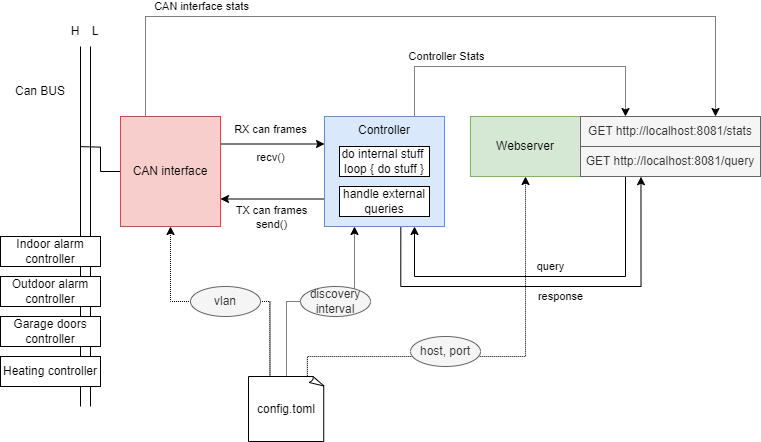

# Setup

Build

    cargo build
    cargo run

Firewall rules:

    sudo firewall-cmd --permanent --add-port=8091/tcp
    sudo firewall-cmd --reload

Access:

    http://localhost:8091

## Architecture

- monolithic application
- single threaded
- async

## Questions:

- Define small parts/modules, which are agnostic of the overall architecture
- Is it a good idea to share a common state within the whole application? Like `SharedHandle`
- `Arc<Mutex<Stats>>` to protect the stats?
- Rust patterns
  - in python we defines objects for everything
  - in C we get a pointer to whatever data we need
  - Clone might be the solution to borrow issues
  - Optimizing too much is not a good idea

Solutions:
- https://ryhl.io/blog/actors-with-tokio/
  - Video: https://www.youtube.com/watch?v=fTXuGRP1ee4
- Box might be solution to lifetime issues
- https://actix.rs/docs/actix/actor/
- https://play.rust-lang.org/?version=stable&mode=debug&edition=2018&gist=1e60fb476843fb130db9034e8ead210c
- 